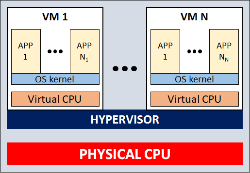
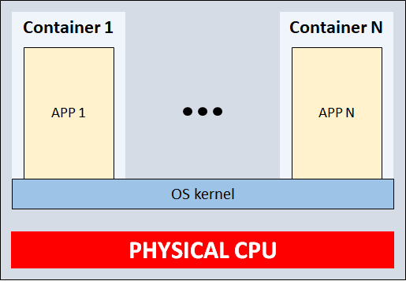
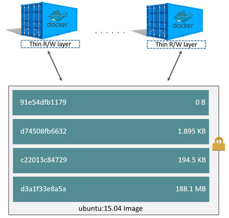
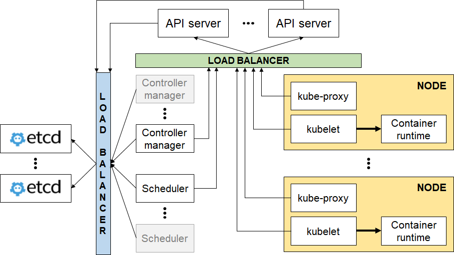
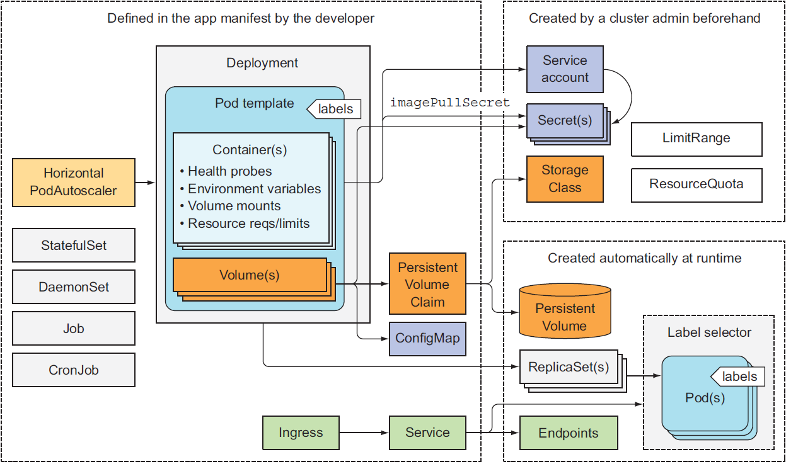

---

# Kubernetes primer
[@fa[twitter] @luigiberrettini](http://twitter.com/luigiberrettini)

---

# Introduction

---

## VMs vs containers

@div[left-50]
<br /><br />

@divend

@div[right-50]
<br /><br />

@divend

---

## Process isolation

**Resource usage** is limited with **cgroups** (control groups)
<br />
<br />
**Resource access** is limited with **namespaces** i.e. a process belongs to a namespace for each type:
 - ipc
 - mnt
 - net
 - pid
 - user
 - uts (UNIX Timesharing System)

---

## Docker basics

@div[left-40]
    @div
        **Image**
        <br />
        <small>
        <ul>
            <li>A set of read-only layers</li>
            <li>A layer is a modification to the filesystem</li>
            <li>On `docker build` a layer is created for each `Dockerfile` statement</li>
        </ul>
        </small>
    @divend

    @div
        <p></p>
        **Registry**
        <br />
        <small>A repository of images</small>
    @divend

    @div
        **Container**
        <br />
        <small>
        <ul>
            <li>A runnable instance of an image</li>
            <li>Each `docker run` creates a writable layer on top of the image read-only ones</li>
        </ul>
        </small>
    @divend
@divend

@div[right-50]
<br />

@divend

---

## Docker container demo
<br />
<br />
```shell
docker container run -d -p 8080:8080 --name dkr-demo luksa/kubia:v1

docker container logs dkr-demo

docker container exec -ti dkr-demo ls -Al

docker container stop dkr-demo
```

---

## Container orchestration
<br />
Provides features missing in Docker:
 - deploy of application stacks
 - health checking and self-healing
 - containers HA (active-active or active-passive)
 - scaling (static or dynamic)
 - groups/users and resource scoping
 - multi-tenancy
 - clustering and optimal hardware utilization

---

## Orchestrators
<br />
<br />
 - Swarm
 - Mesos (general purpose cluster manager)
 - vanilla Kubernetes
 - Kubernetes distribution (e.g. OpenShift, Tectonic)

---

# Kubernetes overview

---

## The name

Greek word meaning helmsman
<br />


---

## Architecture
@div[left-30]
    @div
        <br />
        <small>
            <strong>Master components<br />(control plane)</strong>
            <ul>
                <li>kube-apiserver</li>
                <li>etcd</li>
                <li>kube-scheduler<br />(etcd: leader election)</li>
                <li>controller-manager<br />(etcd: leader election)</li>
            </ul>
        </small>
    @divend

    @div
        <p></p>
        <small>
            <strong>Node components</strong>
            <ul>
                <li>kube-proxy</li>
                <li>kubelet</li>
                <li>container runtime</li>
            </ul>
        </small>
    @divend
@divend

@div[right-70]
<br />

@divend

---

## API resources


---

# Pods

---

## Pod definition and qualities
<br />
 - Group of one or more co-located tightly related containers
 - Runs on a single worker node
 - Runnable whole: containers always run together
 - Allows to run only one process per container
 - Lives in a flat shared network-address space<br />(direct access via IP, no NAT)

---

## Multiple containers
<br />
 - When there is a main process and complementary processes
 - Not when containers can run on different host
 - Not when containers must be scaled individually
 - Containers do not share filesystem
 - Containers share the pod Linux namespace set:
    - pid sharing must be enabled
    - they share IP address (port conflicts)

---

## Descriptor
<br />
 - Kubernetes **API version** used
 - **Type of resource** being described
 - **Metadata**: name, namespace, labels, and other info
 - **Spec**: description of its contents<br />(e.g. containers and volumes)
 - **Status**: info about the running pod<br />(e.g. condition, details about containers, IP)

---

## Creation demo
<div class="spacer">&nbsp;</div>
```shell
kubectl explain pods
kubectl explain pods.spec

kubectl create -f - <<EOF
apiVersion: v1
kind: Pod
metadata:
  name: basic-pod
spec:
  containers:
    - image: luksa/kubia:v1
      name: cntnr
      ports:
        - containerPort: 8012
          protocol: TCP
EOF
```

---

## Common operations demo
<div class="spacer">&nbsp;</div>
<div class="spacer">&nbsp;</div>
```shell
kubectl get pods
kubectl get po basic-pod -o yaml
kubectl get po basic-pod -o json
kubectl describe po basic-pod

kubectl port-forward basic-pod 8000:8012
curl localhost:8000

kubectl logs basic-pod -c cntnr

kubectl delete po basic-pod
```